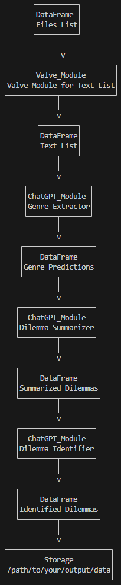

.. _library_analysis:

Book Analysis Tutorial
======================

This tutorial goes over the basics of setting up a ``GPTPipeline``, performing analysis on a set of children's fiction books, and saving results to a file. In this example, we'll identify each books' genres and group them by the ethical dilemmas they present to the reader.

Before you start, go ahead and get an api key from `OpenAI's website <https://platform.openai.com/api-keys>`__. This is necessary because it lets you use ChatGPT for analysis. Copy the key and save it into a file.

Python
------

Installation
^^^^^^^^^^^^

See :ref:`installation` for installation details.

Importing ``GPTPipelines``
^^^^^^^^^^^^^^^^^^^^^^^^^^

After installing ``GPTPipelines``, we need to import it into our python environment.

.. code-block:: python

   import gptpipelines as gpt

Setup
^^^^^

We'll be performing analysis on the top 20 children's fiction books downloaded from `Project Gutenberg <https://www.gutenberg.org/about/>`__. Download the books `here <https://drive.google.com/drive/folders/1UMsZpAgY7_c3py-Dpm5hRTupTbsgyv5_?usp=sharing>`__.

Next, define the absolute path to the folder containing the books:

.. code-block:: python

   books_folder_path = "/path/to/your/books/"

and the path to your OpenAI api key:

.. code-block:: python

   openai_key_path = "/path/to/your/api/key"

Lastly, we'll define where we want the output data to go. Add the path to where you want the output files saved.

.. code-block:: python

   output_data_path = "/path/to/your/output/data"

Then, we'll make a ``GPTPipeline`` object. You can give the ``GPTPipeline`` constructor the plaintext api key, but it's easier and more secure to just pass in the path to the api key:

.. code-block:: python

   pipeline = gpt.GPTPipeline(path_to_api_key=openai_key_path)

After that, we can specify some default values for our pipeline. This is helpful so we don't have to specify the same information for each ChatGPT module we add. For this example, we'll just specify what ChatGPT model to use, plus its context length provided on `OpenAI's model list <https://platform.openai.com/docs/models/gpt-4-and-gpt-4-turbo>`__. We'll use ``gpt-3.5-turbo``, which strikes a good balance between performance and cost effectiveness, and has a context length of 16,385 tokens in March of 2024.

.. code-block:: python

   pipeline.set_default_values(gpt_model='gpt-3.5-turbo', gpt_context_window=16385)

.. note::
   
   For `context`, the context length of a model refers to the amount of `tokens <https://help.openai.com/en/articles/4936856-what-are-tokens-and-how-to-count-them>`__ a model can receive as input. Longer texts can be hundreds of thousands of tokens or more. Since longer texts will often surpass a given model's context length, specifying the context length of the model is necessary so that we know what size chunks the text ought to be broken up into.

Loading Texts
^^^^^^^^^^^^^

Once the pipeline is set up, we can start loading our texts. The ``import_texts()`` function takes at minimum the folder to some text files and a file name. The function compiles each file in the folder you give it and creates a CSV file containing their file paths and whether or not each file has been analyzed. In this case, we'll call our file ``files.csv``, and pass in the path to our directory of books:

.. code-block:: python

   pipeline.import_texts(books_folder_path, "files.csv")

The ``import_texts()`` function also adds a special type of module to the pipeline called a ``Valve_Module``. This is a private class type which accesses the files referenced by the file paths in ``files.csv`` and adds the files' full texts to a new DataFrame called ``Text List``.

Now we can get into analysis!

.. note::
   
   The ``Valve_Module`` is designed to, by default, only import one text into the ``Text List`` DataFrame at a time. Once the text in the ``Text List`` DataFrame is completely analyzed, it is automatically deleted from the DataFrame. This is done to reduce the likelihood of running out of system memory when analyzing a large set of texts.

Adding Modules
^^^^^^^^^^^^^^

Analysis in ``GPTPipelines`` works in modules. A module is a piece of code that takes in information from one or more Pandas DataFrames, and spits out information into one or more different DataFrames. A complete ``GPTPipeline`` consists of one or more modules connected in series, with DataFrames in between to facilitate the transfer of information. When you called ``import_texts()``, it automatically created two DataFrames and a ``Valve_Module`` in between them. The first DataFrame, called 'Files List' by default, contains all the information from your ``files.csv`` file. By stringing together different modules, you can conduct pretty advanced analysis!

Getting Genres from Texts
.........................

First, we'll attempt to extract the genres of each book. To do that, we need to add a ``ChatGPT_Module`` to the end of the pipeline. A ``ChatGPT_Module`` takes one DataFrame as input and one DataFrame as output. We'll start building this new module here:

.. code-block:: python

   pipeline.add_chatgpt_module(

   )

The first parameter we'll give is the module's name. This is how we reference different modules. Since this module will attempt to extract genres from the texts, we'll just call it ``Genre Extractor``. Add this line to your function call:

.. code-block:: python

   name="Genre Extractor",

Then, we need to give it the DataFrame the module will use as input. This will be the DataFrame generated by our ``import_texts()`` call that contains the texts from our books. By default, the ``import_texts()`` function names this DataFrame ``Text List``, so that's what we'll call it. Add this line next:

.. code-block:: python

   input_df_name='Text List',

You also need to define where the output will go. Since this DataFrame will contain ChatGPT's genre predictions, it makes sense to call it ``Genre Predictions``:

.. code-block:: python

   output_df_name='Genre Predictions',

We also need to give the ``ChatGPT_Module`` a prompt that it will respond to. Every time it makes a ChatGPT request, it sends the current text it's analyzing plus the prompt we give it. Creating prompts is an iterative process that can take a while to get just right--This process will be covered in another tutorial. For now, we will use this prompt:

.. code-block:: python

   prompt="This GPT specializes in analyzing excerpts from texts to identify their specific genres, focusing on providing detailed sub-genre classifications. It outputs the three genres, aiming for specificity beyond broad categories, separated by the pipe character (|). This ensures concise and clear responses suitable for parsing by a Python script. The GPT is guided to delve into nuances within the text, seeking out elements that align with specialized niches within known genres, avoiding any extraneous text to facilitate seamless integration with automated processes.",

We'll also add a message that goes right after the text it's analyzing that signifies that the text is done and to begin the prompted task. This is important because it reduces the chance that ChatGPT will ignore the prompt and autocomplete the text, producing useless information.

.. code-block:: python
   
   end_message="\n***END OF TEXT, BEGIN LIST OF THREE GENRES SEPARATED BY '|'***\n",

We need to tell the ``ChatGPT_Module`` what column in the input DataFrame the text is located. By default, the ``import_texts()`` function names this column ``Full Text``, so that's how we'll reference it.

.. code-block:: python

   input_text_column='Full Text',

Lastly, we'll tell the module what it should call the column that holds ChatGPT's response. We'll call it ``Predicted Genres``:

.. code-block:: python

   output_response_column='Predicted Genres'

When you're finished, this is what the final ``add_chatgpt_module()`` call should look like:

.. code-block:: python

   pipeline.add_chatgpt_module(
      name="Genre Extractor",
      input_df_name='Text List', 
      output_df_name='Genre Predictions', 
      prompt="This GPT specializes in analyzing excerpts from texts to identify their specific genres, focusing on providing detailed sub-genre classifications. It outputs the three genres, aiming for specificity beyond broad categories, separated by the pipe character (|). This ensures concise and clear responses suitable for parsing by a Python script. The GPT is guided to delve into nuances within the text, seeking out elements that align with specialized niches within known genres, avoiding any extraneous text to facilitate seamless integration with automated processes.", 
      end_message="\n***END OF TEXT, BEGIN LIST OF THREE GENRES SEPARATED BY '|'***\n",
      input_text_column='Full Text',
      output_response_column='Predicted Genres'
   )

We've successfully added a module! 

Adding a DataFrame
..................

Now, we need to create the module's output DataFrame. Since we named the module's output DataFrame ``Genre Predictions``, we need to name the DataFrame the same thing.

.. code-block:: python

   pipeline.add_df('Genre Predictions')

Summarization of Ethical Dilemmas
.................................

Now, we'll ask ChatGPT to summarize the chunk of text its given, focusing on the primary ethical dilemmas given to the characters. Naturally, this is called a 'Focused Summarization' task. To do this, we'll create a new ``ChatGPT_Module``. We'll name it 'Dilemma Summarizer', set its input DataFrame as 'Genre Predictions', and pull our text from the ``Full Text`` column. We'll call the output DataFrame 'Summarized Dilemmas' and name the column containing the dilemmas 'Summarized Dilemma':

.. code-block:: python

   pipeline.add_chatgpt_module(
      name="Dilemma Summarizer",
      input_df_name='Genre Predictions', 
      output_df_name='Summarized Dilemmas', 
      input_text_column='Full Text',
      output_response_column='Summarized Dilemma'
   )

Add this prompt and end message to the ``add_chatgpt_module()`` call:

.. code-block:: python

   prompt="You are a machine that summarizes dilemmas. Your role is to receive chunks of text from books and summarize them, specifically focusing on presenting the specific ethical dilemma given to the main character. When given a piece of text, carefully identify and extract the core ethical issue at play for the main character, ensuring to maintain neutrality and not to impose any external judgement. Your goal is to present the ethical dilemma in a clear, concise, and understandable manner, making it accessible to the user without requiring them to read the full text. Avoid spoilers outside of the ethical dilemma and ask for clarification if the text is too ambiguous or if the ethical dilemma isn't immediately apparent. Tailor your responses to highlight the complexity of the ethical dilemma, encouraging thoughtful reflection.",
   end_message="\n***END OF TEXT, BEGIN SUMMARY OF ETHICAL DILEMMA***\n"

Then we'll add a dataframe to store the responses:

.. code-block:: python

   pipeline.add_df('Summarized Dilemmas')

Identification of Ethical Dilemmas
..................................

Lastly, we will use our generated summary of the dilemma to pick a dilemma that represents it from a list of generic dilemmas. This last module will read the summary of the dilemma, and then choose. Reading a summary of the dilemma, rather than the entire chunk of text, tends to produce better, more focused results. Call the module "Dilemma Identifier" and set its input DataFrame as "Summarized Dilemmas", its output DataFrame as "Identified Dilemmas", its input text column as "Summarized Dilemma", and the output response column as "Dilemmas":

.. code-block:: python

   pipeline.add_chatgpt_module(
      name="Dilemma Identifier",
      input_df_name='Summarized Dilemmas', 
      output_df_name='Identified Dilemmas', 
      input_text_column='Summarized Dilemma',
      output_response_column='Dilemmas'
   )

Give the module this prompt and end message:

.. code-block:: python

   prompt="You are a GPT designed to read a summary of text from a book and identify the primary ethical dilemma faced by the main character(s). Your task is to understand the story within the given text to make a judgement. While you can identify keywords, your primary focus should be on comprehending the context to ensure your judgement is reasonable. You must avoid any form of commentary or analysis beyond identifying the ethical dilemma and should not use pre-existing knowledge about the text. Always make your best guess without seeking clarifications, as the system does not accommodate back-and-forth interactions. Your responses should be strictly factual and straightforward, suitable for logging in a dataframe for programmatically grouping similar ethical dilemmas. The possible dilemmas you can identify are: Duty vs. Desire, Individual vs. Society, Justice vs. Mercy, Truth vs. Loyalty, Freedom vs. Security, Right vs. Wrong, Self-interest vs. Altruism, Tradition vs. Change, Nature vs. Progress, Honor vs. Survival, Knowledge vs. Ignorance, Love vs. Ambition, Fate vs. Free Will, Past vs. Future, Humanity vs. Technology, Empathy vs. Rationality, Sacrifice vs. Selfishness, None of these.",
   end_message="\n***END OF TEXT, BEGIN IDENTIFIED ETHICAL DILEMMA FROM LIST***\n"

And create its output DataFrame. Be sure to add the data destination path you defined earlier too. This tells the DataFrame where it should be saved when analysis is finished:

.. code-block:: python

   pipeline.add_df('Identified Dilemmas', dest_folder=output_data_path)

Now you've finished creating the ``GPTPipeline``! If you want to see a visualization of your pipeline before running it, add the line ``pipeline.visualize_pipeline()`` to the end and execute the file. You should see something to the effect of:

Processing Texts
^^^^^^^^^^^^^^^^

The last step is the simplest. Just run ``pipeline.process()``!

.. code-block:: python

   pipeline.process()

This file will run our analysis and then save the complete final DataFrame to your output data folder. The last DataFrame holds all of the data that's accumulated throughout the pipeline, so we don't have to save each DataFrame. If you want to see the final DataFrame after processing is complete, just add this line to the end of the file:

.. code-block:: python

   pipeline.print_df('Identified Dilemmas')

And that's it! Here's the completed file:

.. toggle:: book_analysis.py

   .. code-block:: python

      import gptpipelines as gpt

      # define paths for input texts, api key, and output data
      books_folder_path = "/path/to/your/books/"
      openai_key_path = "/path/to/your/api/key"
      output_data_path = "/path/to/your/output/data"

      # setup basic pipeline
      pipeline = gpt.GPTPipeline(path_to_api_key=openai_key_path)
      pipeline.set_default_values(gpt_model='gpt-3.5-turbo', gpt_context_window=16385)
      pipeline.import_texts(books_folder_path, "files.csv")

      # add pipeline modules after valve module
      pipeline.add_chatgpt_module(
         name="Genre Extractor",
         input_df_name='Text List', 
         output_df_name='Genre Predictions', 
         prompt="This GPT specializes in analyzing excerpts from texts to identify their specific genres, focusing on providing detailed sub-genre classifications. It outputs the three genres, aiming for specificity beyond broad categories, separated by the pipe character (|). This ensures concise and clear responses suitable for parsing by a Python script. The GPT is guided to delve into nuances within the text, seeking out elements that align with specialized niches within known genres, avoiding any extraneous text to facilitate seamless integration with automated processes.", 
         end_message="\n***END OF TEXT, BEGIN LIST OF THREE GENRES SEPARATED BY '|'***\n",
         input_text_column='Full Text',
         output_response_column='Predicted Genres'
      )
      pipeline.add_df('Genre Predictions')
      pipeline.add_chatgpt_module(
         name="Dilemma Summarizer",
         input_df_name='Genre Predictions', 
         output_df_name='Summarized Dilemmas',
         prompt="You are a machine that summarizes dilemmas. Your role is to receive chunks of text from books and summarize them, specifically focusing on presenting the specific ethical dilemma given to the main character. When given a piece of text, carefully identify and extract the core ethical issue at play for the main character, ensuring to maintain neutrality and not to impose any external judgement. Your goal is to present the ethical dilemma in a clear, concise, and understandable manner, making it accessible to the user without requiring them to read the full text. Avoid spoilers outside of the ethical dilemma and ask for clarification if the text is too ambiguous or if the ethical dilemma isn't immediately apparent. Tailor your responses to highlight the complexity of the ethical dilemma, encouraging thoughtful reflection.",
         end_message="\n***END OF TEXT, BEGIN SUMMARY OF ETHICAL DILEMMA***\n",
         input_text_column='Full Text',
         output_response_column='Summarized Dilemma'
      )
      pipeline.add_df('Summarized Dilemmas')
      pipeline.add_chatgpt_module(
         name="Dilemma Identifier",
         input_df_name='Summarized Dilemmas', 
         output_df_name='Identified Dilemmas', 
         prompt="You are a GPT designed to read a summary of text from a book and identify the primary ethical dilemma faced by the main character(s). Your task is to understand the story within the given text to make a judgement. While you can identify keywords, your primary focus should be on comprehending the context to ensure your judgement is reasonable. You must avoid any form of commentary or analysis beyond identifying the ethical dilemma and should not use pre-existing knowledge about the text. Always make your best guess without seeking clarifications, as the system does not accommodate back-and-forth interactions. Your responses should be strictly factual and straightforward, suitable for logging in a dataframe for programmatically grouping similar ethical dilemmas. The possible dilemmas you can identify are: Duty vs. Desire, Individual vs. Society, Justice vs. Mercy, Truth vs. Loyalty, Freedom vs. Security, Right vs. Wrong, Self-interest vs. Altruism, Tradition vs. Change, Nature vs. Progress, Honor vs. Survival, Knowledge vs. Ignorance, Love vs. Ambition, Fate vs. Free Will, Past vs. Future, Humanity vs. Technology, Empathy vs. Rationality, Sacrifice vs. Selfishness, None of these.",
         end_message="\n***END OF TEXT, BEGIN IDENTIFIED ETHICAL DILEMMA FROM LIST***\n",
         input_text_column='Summarized Dilemma',
         output_response_column='Dilemmas'
      )
      pipeline.add_df('Identified Dilemmas', dest_folder=output_data_path)

      # run pipeline and print final results
      pipeline.process()
      pipeline.print_df('Identified Dilemmas')

R
-
Using ``GPTPipelines`` in R is currently not supported, but I plan to implement it in the future!
